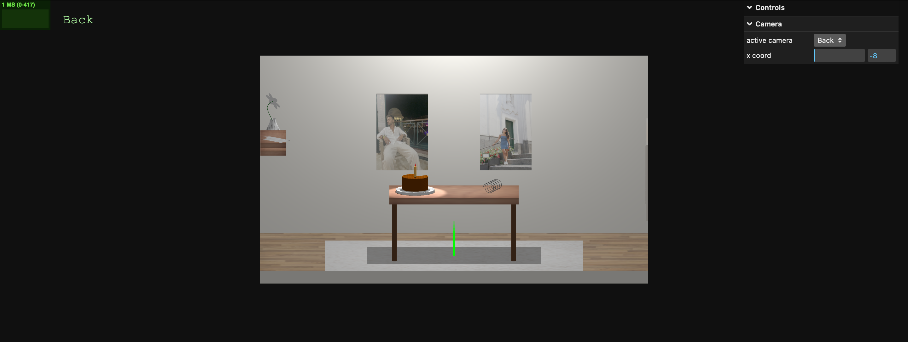
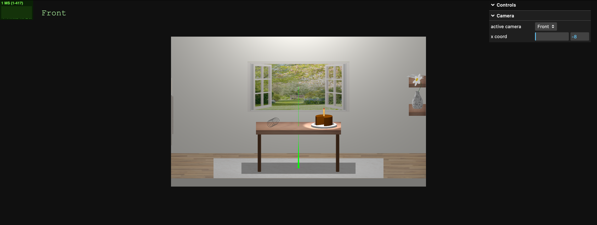
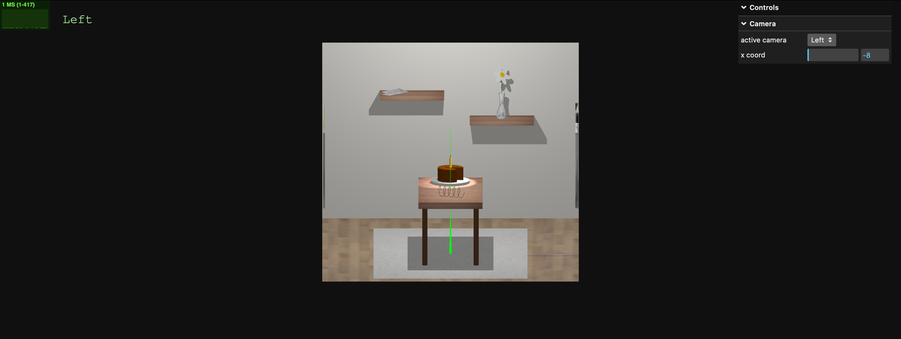
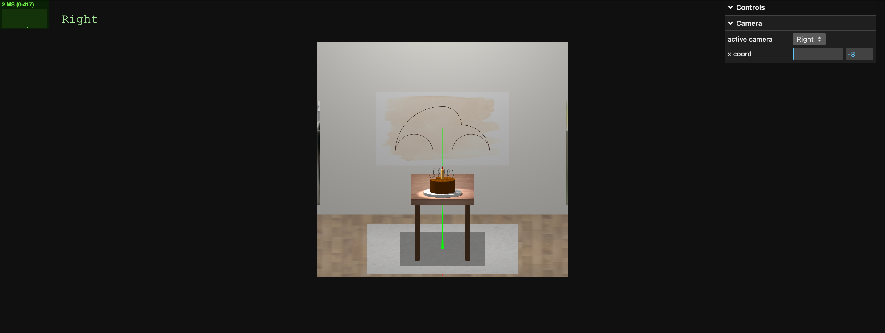
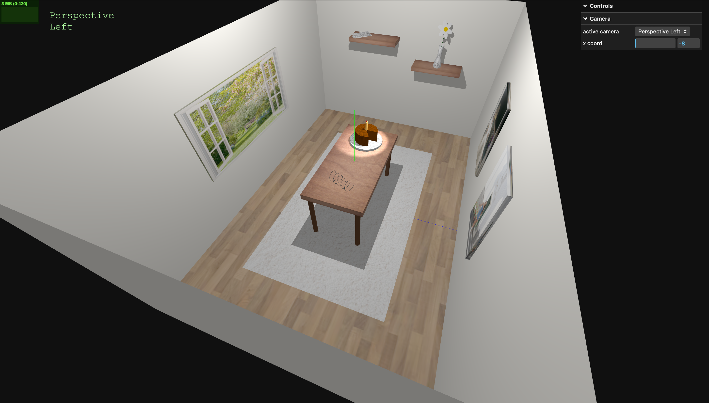
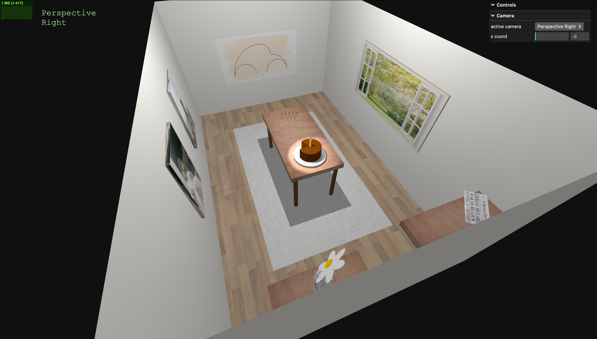

# SGI 2023/2024 - TP1

## Group: T07xG09

| Name             | Number    | E-Mail             |
| ---------------- | --------- | ------------------ |
| Hugo Gomes       | 202004343 | up202004343@up.pt  |
| Lia Vieira       | 202005042 | up202005042@edu.fe.up.pt  |

----
## Project information

In this project, we created a room constituted by the floor and 4 walls. The rooms has a rug on the floor and a table. On top of the table there is a spring and a plate with a cake on it. The cake has one slice missing and a candle in the middle. There is a spotlight pointing to the cake.

On the walls, there are two paintings with photographs of the students, a painting of a carocha, a window with a view and two shelves. On top of one shelf there is a newspaper and, on top of the other one, there's a jar with a flower inside.

There are 6 cameras that provide different perspectives of our scene.

  Check out our project [here](https://git.fe.up.pt/sgi-meic/sgi-2023-2024/t07/sgi-t07-g09/-/blob/main/tp1/main.js?ref_type=heads).

## Issues/Problems

Our main dificulties were how to properly set up the shadows, since, initially, the shadow of the table was being received by the floor instead of the carpet.

## Screenshots

### 1 - Back View

### 2 - Front View

### 3 - Left View

### 4 - Right View

### 5 - Perspective Left View

### 6 - Perspective Right View

