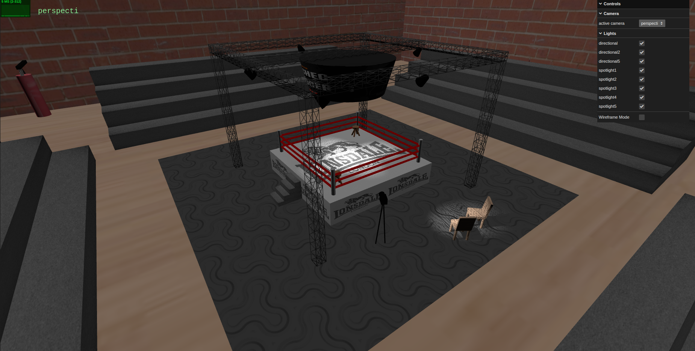

# SGI 2023/2024 - TP1

## Group: T07xG09

| Name             | Number    |
| ---------------- | --------- |
| Hugo Gomes       | 202004343 |
| Lia Vieira       | 202005042 |

----
## Project information

In this project, we created a boxing arena constituted by a floor, four walls, and a ceiling. The room features a boxing ring positioned in the center, accompanied by a bench in two of the corners. Surrounding the ring, there are two chairs, a camera, a metallic structure supporting a big screen with a polygon, and five spotlights. Beneath these items, there is a rug to allow athletes to run around barefoot. Additionally, there are four grandstands, one on each side of the ring. In the arena corners, you can also find a decorative vase and two punching bags for spectators to entertain themselves while waiting for the battles.

There are 3 cameras that provide different perspectives of our scene.

  Check out our project [here](https://git.fe.up.pt/sgi-meic/sgi-2023-2024/t07/sgi-t07-g09/-/blob/main/tp2/main.js?ref_type=heads).

## Issues/Problems

Our main dificulties were how to build the polygon, since it would need to support different number of sides and come up with new ideas to the scene.

## Screenshots

### 1 - Perspective 1

### 2 - Perspective 2

### 3 - Camera View

### 4 - Grandstand View

### 5 - Perspective 3

