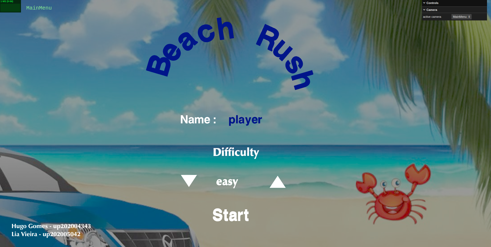
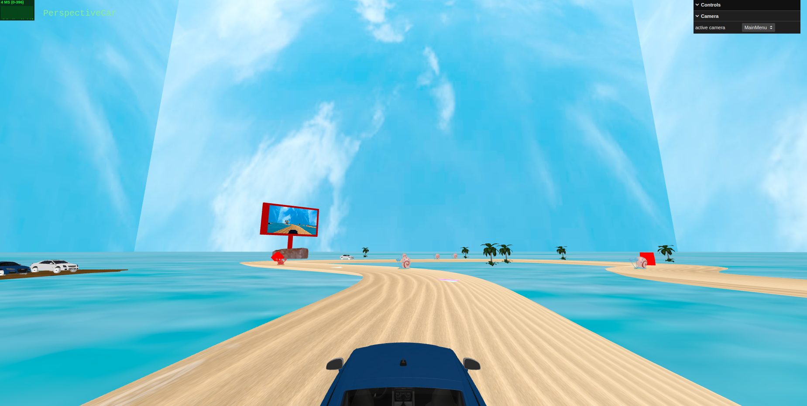
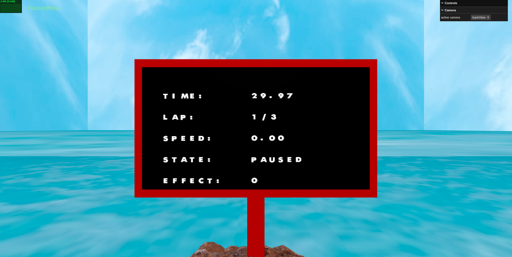
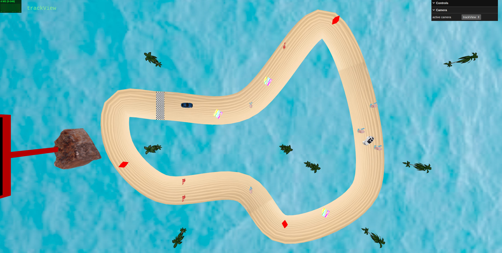
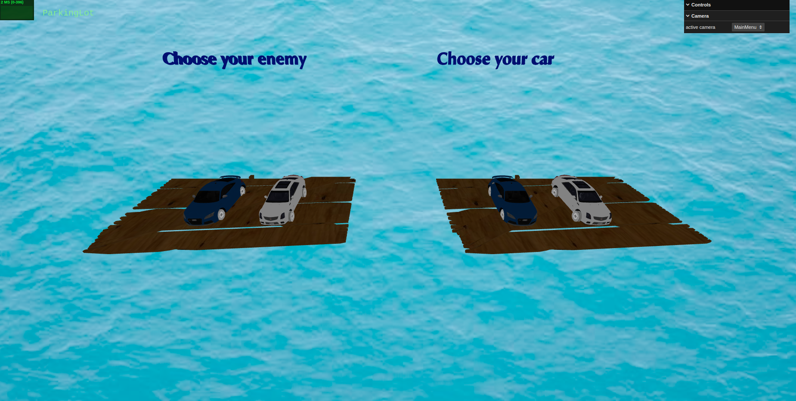
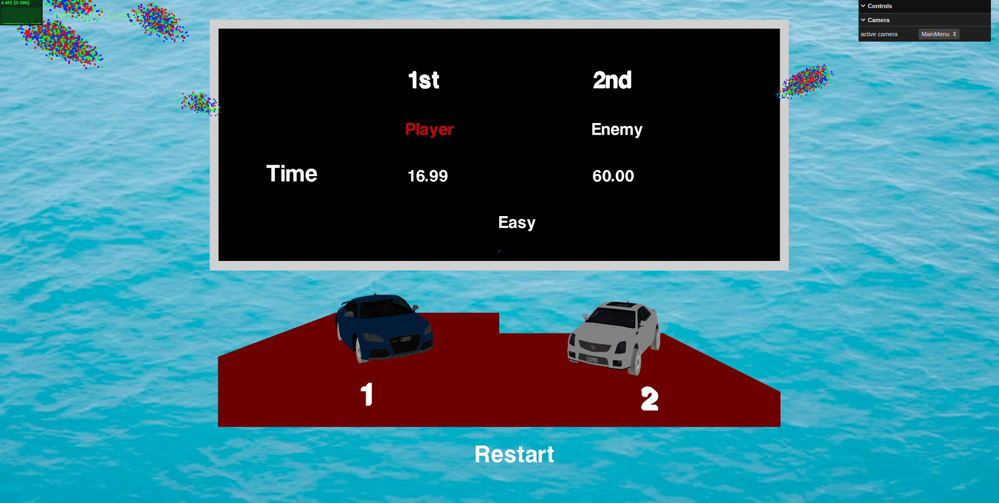

# SGI 2023/2024 - TP3

## Group: T07xG09

| Name             | Number    |
| ---------------- | --------- |
| Lia Vieira       | 202005042 |
| Hugo Gomes       | 202004343 |
----
## Images

| MainMenu           | Gameplay Example     |
| ---------------- | --------- |
|         |  |

|  Pause Menu  |  Track View   |
| ---------------- | --------- |
| | |

|  Parking Lot |  EndMenu   |
| ---------------- | --------- |
| | |
## Project information

### Game
- Interactive Racing Car game
- This game has the following features:
  - MainMenu where the user can choose the difficulty of the game as well as the name
  - Parking Lots scene where the user can choose the car he wants to play with as well as the car of the opponent
  - Gameplay where the user can control the car with the WASD keys
  - PowerUps that can be collected by the user
  - Obstacules that can be hit by the user
  - Pause Menu where the user can pause the game and resume it and see different information about the game
  - EndMenu where the user can see the final times and the winner of the game 
  - Restart Button in the EndMenu that restarts the game
  - Outdoor with a printscreen every 60 seconds of the player view

### Scene

- Our scene is a beach racing environment. The sandy track features strategic power-ups, such as time-reducing cubes and speed-boosting rainbow planes, and obstacles, such as toggle-changing crab and reducing-speed snail.

Also, two outdoors are visible. One presenting the information about the game, such as player's speed, time, number of laps, game state and the time left of the power-up/obstacle effect.The second outdoor presents a 3D screenshot of the scene, updated every 60 seconds. Visuals are enhanced using shaders, including a pulsating effect on the time power-up and a 3D shader on an additional outdoor display.

- Check out our project [here](https://git.fe.up.pt/sgi-meic/sgi-2023-2024/t07/sgi-t07-g09/-/blob/main/tp3/index.html?ref_type=heads)

----
## Issues/Problems

- Only a limited set of cameras are available
